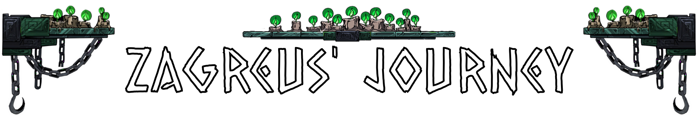
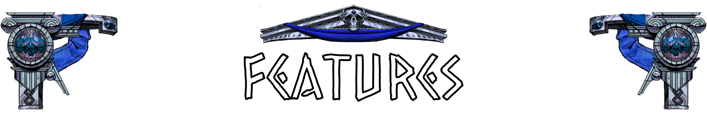
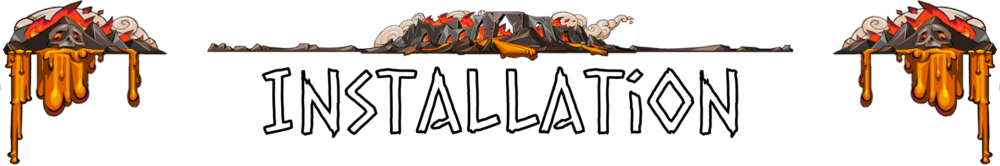
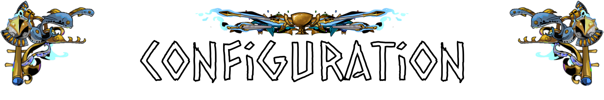
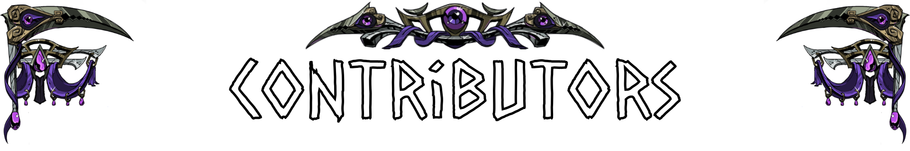
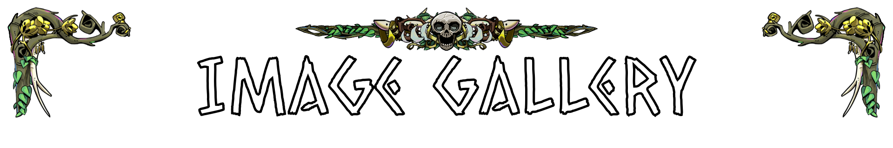
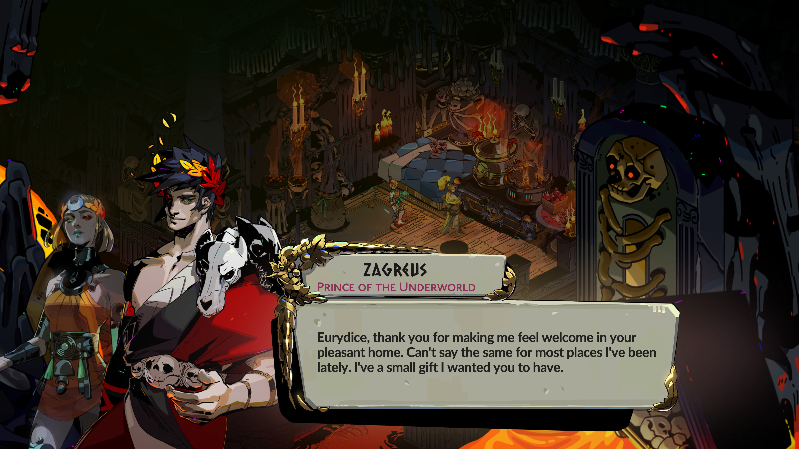
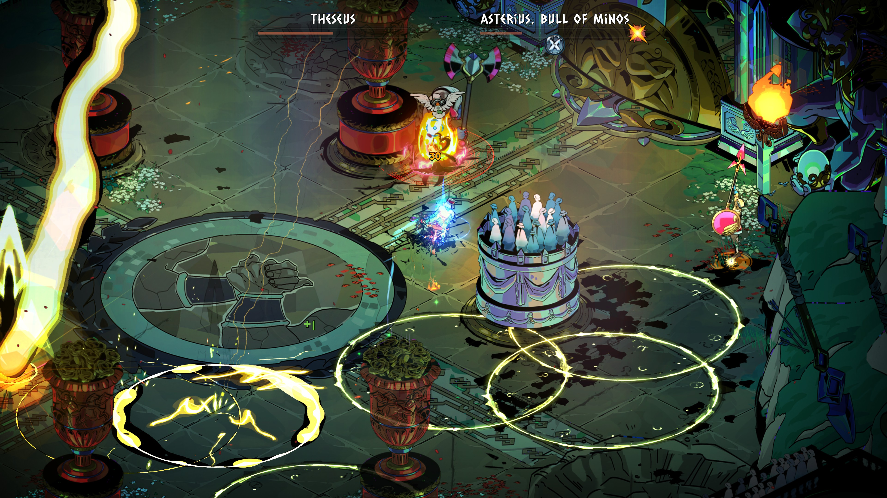
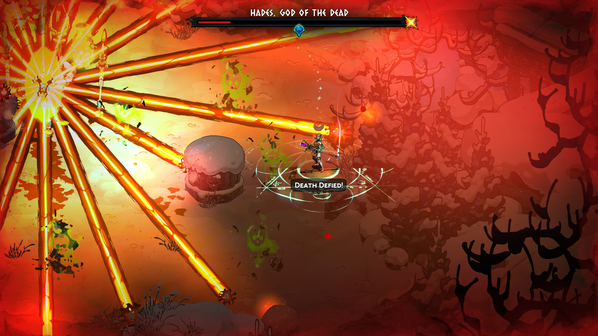

<!-- # Zagreus' Journey -->

_Zagreus' Journey_ is a mod for Hades II that adds the original route Zagreus took through Tartarus, Asphodel, Elysium and the Temple of Styx in the first game to the sequel.  
Escape the Underworld as Melinoë, battle familiar foes and bosses using her unique abilities and weapons, meet Zagreus' old friends, and reconnect with your family's past - all integrated into the main game as if it was always there: Naturally progress through the new biomes, unlock new incantations to perform, reveal and complete new Minor Prophecies, forge bonds with NPCs in familiar and new locations, collect over 30 new resources to spend on new cosmetics and music, and test your skills with new Testaments, Chaos Trials and in Dream Dives.
Find the full list of features below!

This mod has been officially endorsed by the developer!
[Supergiant Games: We're blown away by this mod!](https://x.com/SupergiantGames/status/2051709669476012501)

Wonder what it plays like?

Check out the [Zagreus' Journey 1.0 Release Trailer](https://www.youtube.com/watch?v=rxuTLSPqIEE), or take a look at what Haelian and Boated think of the mod:

- [The Most Amazing Mod for Hades 2 is Complete. | Haelian](https://www.youtube.com/watch?v=K7FGiTfv7fA)
- [So, someone put Hades 1 in Hades 2 and it's amazing. | Haelian](https://www.youtube.com/watch?v=SIVrJya47YQ)
- [They put Hades 1 in Hades 2 and it's PERFECT | Boated](https://www.youtube.com/watch?v=HYf_z8IV4LE)

  
  

 
After installing the mod, a Chaos Gate will appear in the Crossroads' Training Grounds, which will allow you to experience Zagreus' journey through the Underworld as Melinoë.

It is highly recommended that you complete the main story of the first Hades game before playing with this mod, as not all story events are included.

> Refer to the [FAQ in the wiki](https://github.com/NikkelM/Hades-II-HadesBiomes/wiki) with any questions before opening an issue.

> You can find all of the latest changes in the [Changelog](https://thunderstore.io/c/hades-ii/p/NikkelM/Zagreus_Journey/changelog/) on the mod page.

<!-- ## Features -->

- Play through the original four biomes of Hades as Melinoë: Tartarus, Asphodel, Elysium and the Temple of Styx.
- Discover and overcome the challenge of fighting all of the original game's enemies and bosses using Melinoë's unique abilities and weapons.
- Relive Zagreus' story by escaping to the Surface, forging bonds with your brother's old friends, and conversing with the Fury Sisters, the Champions of Elysium and [REDACTED] himself.
- Benefit from a multitude of entirely new boons and effects offered to you by Sisyphus, Eurydice, Patroclus... and other familiar faces that you will now be able to meet along the way!
- Collect **30+** new resources specific to the new biomes, use them for unlocks in this and other mods (see section below), and trade them with the Broker.
- Unlock **29** new musical tracks from Hades' original soundtrack through the [Hades OST for the Music Maker](https://thunderstore.io/c/hades-ii/p/NikkelM/Hades_OST_for_the_Music_Maker/) mod integration (automatically installed with this mod).
- Decorate the Crossroads with **55+** new cosmetics, including new **Cauldrons**, **Arcana Card Backs**, and **Charms** inspired by Zagreus' companions from the first game.
- Discover and complete **40+** new Minor Prophecies at the Fated List.
- Complete **24** new testaments by clearing the new bosses using each of your weapons with new fear levels.
- Discover and perform **20+** new incantations to unlock gameplay features and progress story events in Zagreus' Journey.
- Unlock **six** of the original game's keepsakes by forging relationships with Sisyphus, Eurydice, Patroclus, Orpheus, Megaera and Thanatos through the [Shared Keepsake Port](https://thunderstore.io/c/hades-ii/p/zannc/SharedKeepsakePort/) mod integration (automatically installed with this mod).
- Challenge yourself with a set of new **Chaos Trials**, including randomized "Chaos Within" trials in the spirit of (Great) Chaos Above and Below.
- Advance through **50** new cosmetic-only ranks at the Spirit Mixer, from the lowly "_Alpha Warden_" to the feared "_Unseen One_".
- Earn a new set of **three statues** from Commander Schelemeus by escaping the Nightmare Realm at progressively higher fear.
- The four new regions can also appear in **Dream Dives** (but you can use the mod config to exclude them if you so wish).
- Read all about the new biomes, enemies, bosses and friends in a **new chapter** in your Codex.

### Integrations with other Mods

Some other mods integrate with _Zagreus' Journey_ to provide additional features, alternative functionality, or use the resources introduced by this mod:

- [Dream Dive Tweaks](https://thunderstore.io/c/hades-ii/p/zerp/DreamDiveTweaks/) allows you to run longer Dream Dives, including all 12 available regions in a single run if _Zagreus' Journey_ is installed as well. The mod also adds some Quality of Life improvements and bug fixes for Dream Dives.
- [Flip the Arcana](https://thunderstore.io/c/hades-ii/p/ReadEmAndWeep/Flip_the_Arcana_Mod/) adds flipped versions of the Arcana cards with wildly different effects, and will require resources from _Zagreus' Journey_ to unlock them if both mods are installed.
- [Charon's Tip Jar](https://thunderstore.io/c/hades-ii/p/NikkelM/Charons_Tip_Jar/) adds a tip jar to Charon's shop rooms during _Zagreus' Journey_ underworld runs.
- [NPC Room Randomizer](https://thunderstore.io/c/hades-ii/p/zerp/NPCRoomRandomizer/) randomizes which NPCs appear in which biome, and will include NPCs from _Zagreus' Journey_ if both mods are installed.

> Are you developing a mod that integrates with _Zagreus' Journey_, or would like to add such an integration? Let me know on [Discord](https://discord.gg/KuMbyrN) in the [#h1-run-h2](https://discord.com/channels/667753182608359424/1443569685407989842) channel.

<!-- ## Installation -->

You _must_ have **Hades** installed on your system at all times when playing with this mod.

To install the mod, follow these simple steps:

1. Install [r2modman](https://thunderstore.io/c/hades-ii/p/ebkr/r2modman/) (use `Manual Download`, then run the setup executable).
2. Find _Zagreus' Journey_ on the `Online` tab, or use `Install with Mod Manager` on the [mod's Thunderstore page](https://thunderstore.io/c/hades-ii/p/NikkelM/Zagreus_Journey/). All dependencies are installed automatically.
3. Start the game through the mod manager using `Start Modded`. The loading screen on first launch will take longer than usual while the mod installs required files (~5GB additional disk space is needed in total).

If the mod was installed successfully, you will see a new logo appear in the main menu.

Please also keep the following in mind:

- You must uninstall your Hades 1 mods (rename or delete the `Mods` folder and run `modimporter.exe`) before using this mod. Zagreus' Journey is compatible with other Hades II mods.
- If Hades and Hades II are installed in different parent folders (e.g. through different storefronts), set the `hadesGameFolder` in the mod's [configuration file](https://github.com/NikkelM/Hades-II-HadesBiomes/wiki/Configuration) to your Hades install path.
- Is your Hades II installed through Epic Games? You may need to follow [this FAQ entry](https://sgg-modding.github.io/Hades2ModWiki/docs/installing-mods/getting-started#i-own-hades-ii-on-epic-games-and-mods-do-not-work-when-playing-what-can-i-do) if mods don't seem to be active.
- Installing the mod on Steam Deck? Follow the [Steam Deck guide](https://sgg-modding.github.io/Hades2ModWiki/docs/installing-mods/steam-deck) in the wiki.
- Installing the mod on Mac? Follow the [Mac guide](https://sgg-modding.github.io/Hades2ModWiki/docs/installing-mods/mac) in the wiki.

For more information or troubleshooting, see the [Installation wiki page](https://github.com/NikkelM/Hades-II-HadesBiomes/wiki/Installation-&-Uninstallation).

<!-- ## Configuration -->

Note that the configuration file is only created after the first game start with the mod enabled in your mod manager.

If you are using r2modman or the Thunderstore Mod Manager, you can modify the config directly through the mod manager, in the `Config editor` tab.
Make sure to save the file once done.

You can find an explanation of all configuration options [on this wiki page](https://github.com/NikkelM/Hades-II-HadesBiomes/wiki/Configuration).

### Feedback & Bug Reports

Please directly leave bug reports as a [new issue on the project's GitHub repository](https://github.com/NikkelM/Hades-II-HadesBiomes/issues/new?template=bug_report.md), or [start a discussion](https://github.com/NikkelM/Hades-II-HadesBiomes/discussions) for general feedback, suggestions and questions.

If you do not have a GitHub account, you can also join the [Hades II Modding Discord server](https://discord.gg/KuMbyrN) and post in the [#h1-run-h2](https://discord.com/channels/667753182608359424/1443569685407989842) channel.

<!-- ## Contributors -->

- NikkelM ([GitHub](https://github.com/NikkelM), @NikkelM on [Discord](https://discord.gg/KuMbyrN)), Mod Creator

 

- iDeathHD ([GitHub](https://github.com/xiaoxiao921), @iDeathHD on [Discord](https://discord.gg/KuMbyrN)), Hell2Modding Maintainer
- @burn on [Discord](https://discord.gg/KuMbyrN), Artwork & Resource Design
- Magic_Gonads ([GitHub](https://github.com/AndreLouisIssa), @Magic_Gonads on [Discord](https://discord.gg/KuMbyrN)), ModUtil Maintainer
- zannc ([GitHub](https://github.com/excellent-ae), @dwbl. on [Discord](https://discord.gg/KuMbyrN)), Creator of [Shared Keepsake Port](https://thunderstore.io/c/hades-ii/p/zannc/SharedKeepsakePort/) (automatically installed with this mod)
- zerp ([GitHub](https://github.com/adi1998), @zerp on [Discord](https://discord.gg/KuMbyrN)), Additional Testing & Bugfixes
- @Aunuch on [Discord](https://discord.gg/KuMbyrN), Collaborator on the mod's Key Art
- ...and the many other modding community members that tested early versions, provided feedback and reported bugs!

### Contribute Yourself!

You can contribute to this mod by providing translations!
The mod adds many different kinds of text, such as for the new resources, boons etc. 
If you would like to translate some or all of these into your native language, you can find all texts in the [src/Game/Text/\<language shorthand\>](https://github.com/NikkelM/Hades-II-HadesBiomes/tree/main/src/Game/Text) folder of the mod's repository.
If you decide to translate a category, please translate all texts in that category to ensure consistency for players.

For Cosmetics, texts are located in [src/Scripts/CosmeticsData.lua](https://github.com/NikkelM/Hades-II-HadesBiomes/tree/main/src/Scripts/CosmeticsData.lua), directly assigned to each cosmetic item.

After translating your chosen texts, open a Pull Request with your changes on GitHub, and they will be included in the next release!

<!-- ## Image Gallery -->

  
  

  
  

  
  

  
  

 

Congratulations, you've made it to the bottom of the page!

If you are enjoying this mod and want to say thank you, you can leave a donation on [Ko-Fi](https://ko-fi.com/nikkelm) or [GitHub Sponsors](https://github.com/sponsors/NikkelM).

This mod does not, and never will, use generative AI for any art, voice or music.

## Disclaimer

This mod is a fan-project and while [endorsed by](https://x.com/SupergiantGames/status/2051709669476012501), it is not affiliated with by Supergiant Games.
All original code, art, music, voice & game design of Hades is copyright Supergiant Games.
