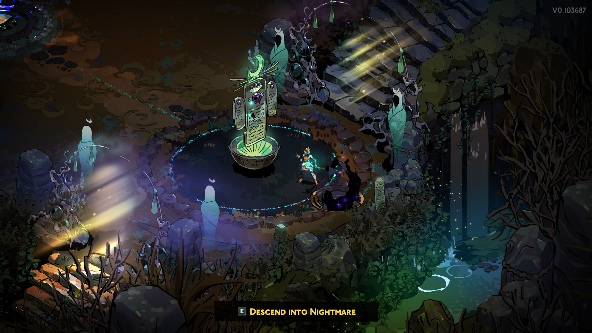

# Hades (Almost) Total Conversion for Hades II

This mod adds encounters and enemies from Hades to Hades II.

> The mod is still early in development, and not everything is working as expected.

> **Warning**: I do not recommend using this mod on any active "real" saves during this WIP period. It's recommended to use a save file dedicated to testing or developing mods, and to create a backup of all save files before using the mod.

  

  

> It is recommended to not tab out of the game or otherwise unfocus the window while the game is starting up or loading, as this can sometimes cause the game to load data incorrectly. This would mean you need to restart the game.

## Prerequisites

In order to use this mod you _must_ have Hades installed on your system when playing Hades II.
You cannot uninstall Hades after insalling the mod, as the mod will not work without it.

It is recommended to have both Hades and Hades II installed through the same platform (e.g. both through Steam or both through Epic)/in the same parent directory.

> **Warning**: To be able to use the mod, Hades must be installed at **ALL TIMES**.

Read on at [Installation](#installation) for information on how to install the mod through r2modman.

## Features

> **Note**: This mod is a work in progress. Not everything is working as expected or fully implemented.

The following content from Hades is available in Hades II through this mod, allowing you to play as Melinoë, with her weapons and abilities.

At the moment, content is limited to encounters and enemies.

### Encounters/Rooms:

| Encounter/Room Name | Internal Name                           | Status          |
| ------------------- | --------------------------------------- | --------------- |
| **Tartarus**        |                                         |                 |
| Default combat      | GeneratedTartarus                       | Implemented     |
| Fountain room       | A_Reprieve01                            | Implemented     |
| Survival challenge  | SurvivalTartarus                        | Not implemented |
| Thanatos encounter  | ThanatosTartarus                        | Not implemented |
| Miniboss encounters | A_MiniBoss0x                            | Not implemented |
| Shops               | A_Shop01/A_PreBoss01                    | Not implemented |
| Bosses              | A_Boss01/A_Boss02/A_Boss03/A_PostBoss01 | Not implemented |
| **Asphodel**        |                                         | Not implemented |
| **Elysium**         |                                         | Not implemented |
| **Styx**            |                                         | Not implemented |
| **Surface**         |                                         | Not implemented |

### Enemies

| Enemy                  | Internal Name        | Status          |
| ---------------------- | -------------------- | --------------- |
| **Tartarus**           |                      |                 |
| Wretched Lout          | PunchingBagUnit      | Implemented     |
| Dire Lout (Elite)      | PunchingBagUnitElite | Implemented     |
| Wretch Thug            | HeavyMelee           | Implemented     |
| Dire Thug (Elite)      | HeavyMeleeElite      | Implemented     |
| Wringer                | DisembodiedHand      | Implemented     |
| Wringer (Elite)        | DisembodiedHandElite | Implemented     |
| Wretched Witch         | LightRanged          | Implemented     |
| Dire Witch (Elite)     | LightRangedElite     | Implemented     |
| Brimstone              | HeavyRanged          | Implemented     |
| Dire Brimstone (Elite) | HeavyRangedElite     | Implemented     |
| Numbskull              | Swarmer              | Implemented     |
| Dire Numbskull         | SwarmerElite         | Implemented     |
| Skullomat              | LightSpawner         | Not implemented |
| Wretched Pest          | ThiefMineLayer       | Not implemented |
| Dire Pest (Elite)      | ThiefMineLayerElite  | Not implemented |
| **Asphodel**           |                      | Not implemented |
| **Elysium**            |                      | Not implemented |
| **Styx**               |                      | Not implemented |
| **Surface**            |                      | Not implemented |

### Not implemented yet, but somewhat planned

In no particular order:

- Sound effects/original Hades enemy sounds
- (Mini) Boss encounters
- Additional biomes
- Light story elements

### Would be nice, but likely not possible (as easily)

- Hades God boons
- Playing as Zagreus/Switching between characters

## Installation

Add the mod to your r2modman profile as usual.
During development, you will need to manually build and add the package to your profile.

Use `tcli build` in the root of the repository to build the package.
In r2modman, use `Import local mod` to add the package to your profile.

If you have both Hades and Hades II installed in the same folder (i.e. the default `steamapps/common` folder for Steam games), you don't need to do anything else.
Otherwise, change the `hadesGameFolder` config option in the mod config to point to your Hades installation folder, as an absolute path.
You may want to start the game once with the mod enabled to have r2modman generate the config file.

That's it - when first starting the game, the mod will copy any required files from your Hades installation into your Hades II installation.

> **Note**: With the current approach, these files will stay in your game folder and be read by the game even if you switch profiles or play vanilla. I do not expect this to cause any issues, as the data within these files should just not have any effect in these cases. If you want to make a clean switch, use the `uninstall` option in the mod config to remove the files from your game folder.

<!-- TODO: How much disk space is needed? #10 -->

> **Note**: Using this mod will copy files from the Hades installation folder to the Hades II folder. This requires at least an additional **XX** GB of disk space.

## Uninstallation

Before removing the mod from r2modman, you should set the `uninstall` option in the mod config to `true` and start the game once.
This will remove any files that were copied from the Hades game folder from your Hades II installation folder.
If you remove the mod before uninstalling, these loose files will remain in the Hades II folder indefinitely, and may cause issues further down the line.

If you ever have any issues with the mod, set both the `uninstall` and `firstTimeSetup` options to `true` and start the game once.
This will first uninstall, and then install the mod again.

## Configuration

These are the configuration options available for the mod:

| Name              | Type     | Default | Description                                                                                                                                                                                                                                                                                           |
| ----------------- | -------- | ------- | ----------------------------------------------------------------------------------------------------------------------------------------------------------------------------------------------------------------------------------------------------------------------------------------------------- |
| `enabled`         | `bool`   | `true`  | Whether the mod is enabled or not.                                                                                                                                                                                                                                                                    |
| `firstTimeSetup`  | `bool`   | `true`  | If set to true, the mod will make required file associations and moves from the `hadesGameFolder` to your Hades II installation when the game is started the next time. This process will set this variable to false afterwards. Only set this to true after a breaking update or when re-installing. |
| `uninstall`       | `bool`   | `false` | Set this to true and start the game once to run uninstall steps, which removes files copied and associated to Hades. Do this before uninstalling the mod through r2modman to avoid loose files staying behind. To re-install, set both `uninstall` and `firstTimeSetup` to true.                      |
| `hadesGameFolder` | `string` | `root`  | The path to the Hades game folder. When set to `root`, resolves to the "Hades" directory in the same parent directory as your Hades II installation. I.e., leave like this if you have both games installed through Steam.                                                                            |
| `debug`           | `bool`   | `false` | Enables debug logging to the console. Enable this if you're having issues with the mod, or if the developer asked you for logs to help investigating an issue.                                                                                                                                        |

## Notes for other developers

Some of the knowledge I gathered during development can be found in the [knowledge.md](docs/knowledge.md) file - though this is a living document and may not be comprehensive or up to date.
